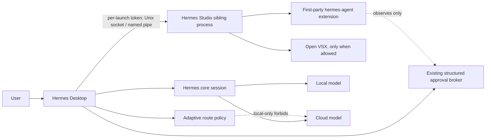

# ADR-001: Hermes Studio as a governed Eclipse Theia sibling product

- Status: Accepted for foundation implementation
- Date: 2026-07-18
- Owners: Hermes Desktop and Agent maintainers
- Decision scope: optional desktop IDE capability; not the Adaptive Local AI implementation

## Context and decision

Hermes needs an IDE-grade surface without turning the existing chat desktop into an editor fork or weakening its approval boundary. We will build **Hermes Studio** as a separately versioned Eclipse Theia desktop product. Hermes Desktop launches Studio as a sibling process and connects it to one exact workspace, window, and governed Hermes session over an authenticated local IPC endpoint.

We selected and consume the existing
[`intelli-verse-x/theia`](https://github.com/intelli-verse-x/theia) fork over
Code-OSS. The first product commit is pinned to
`425e874dbd19e85d65046d6daa08cc02f2d9a85d`, based on upstream
`3595b053a48a1a4c7171aea0361a25f782140af9`:

- Theia is an Eclipse Foundation project under EPL-2.0 (with its documented secondary license), supports commercial products, is modular at npm package boundaries, has no telemetry by default, and uses Open VSX by default.
- Code-OSS is source code rather than Microsoft's Visual Studio Code distribution. Building a differentiated distribution requires ongoing fork, product-service, branding, marketplace, and update work. Microsoft Marketplace APIs and marketplace content are not licensed as a generic third-party product service.
- Theia offers compile-time application extensions and a compatible extension-host API without embedding an IDE in Hermes Desktop or coupling Studio releases to Desktop.
- Hermes Studio uses only original neutral branding and the names “Hermes Studio,” “Eclipse Theia,” and “Open VSX” in their factual nominative senses. It does not use Microsoft product marks or Marketplace APIs.

Primary references:

- <https://theia-ide.org/docs/faq/>
- <https://theia-ide.org/docs/extensions/>
- <https://theia-ide.org/docs/composing_applications/>
- <https://www.eclipse.org/legal/epl-2.0/>
- <https://open-vsx.org/about>

The downstream product lives at `examples/hermes-studio` and its first-party
bridge at `packages/hermes-bridge` in that fork. It composes the fork's coherent
1.73.0 package line; Hermes Desktop never substitutes npm's generic Theia
application. Source provenance is packaged in
`assets/hermes-studio-source.v1.json`.

## Architecture and responsibility split

Hermes Desktop owns installation consent, launch/focus/stop, process supervision, version slots, manifest verification, exact workspace/session/window identity, secure token creation, route policy, and all approval decisions. Hermes core owns agent execution, provider credentials, structured tool policy, prompt streaming, and reviewed mutation execution.

Studio owns editing, navigation, selected-context collection, diagnostics, rendering stream events, displaying route and approval state, and collecting a user's proposed WorkspaceEdit review. The first-party extension cannot approve, execute a model shell, access provider keys, alter local/cloud policy, or apply an unreviewed mutation.

## Protocol and transport

Protocol v1 uses envelopes with protocol version, unpredictable request ID, session ID, issue time, and expiry. A 256-bit per-launch token is delivered only to the spawned process. Handshakes are constant-time verified, expire quickly, and request IDs are replay-protected. Capability negotiation is explicit and fail-closed.

POSIX uses a user-private Unix-domain socket under Desktop user data; Windows uses a random named pipe. The broker never listens on TCP. Socket/pipe ownership and permissions are validated before accepting the connection. Reconnect requires a fresh authenticated handshake; tokens are never persisted to workspace files or logs.

Allowed protocol families are handshake/capabilities, identity, selected context, diagnostics, prompt submit/stream, route status, approval observation, reviewed WorkspaceEdit, reconnect, and health. Schemas reject provider-secret-shaped keys. Payload sizes, context length, diagnostic count, concurrent streams, and request lifetimes are bounded.

## Threat model and fail-closed behavior

We assume a malicious workspace, extension, dependency, archive, renderer payload, stale Studio process, replayed local request, compromised download mirror, and prompt injection in source files.

- Untrusted workspaces start `restricted`. Context and diagnostics may be offered only after bounded user-visible selection; mutation capability is withheld.
- Unknown protocol versions, methods, capabilities, identities, routes, fields, or request IDs are rejected.
- Workspace paths must be absolute and canonical. A Studio window cannot change its session/workspace linkage after handshake.
- Provider secrets never cross into Studio. Desktop secure storage remains the source of truth. On Linux, if the existing secure facility reports unavailable/plaintext-only storage, secret-dependent setup fails closed.
- The renderer gets a fixed `hermesDesktop.studio` allowlist. It receives no raw IPC, process, filesystem, token, or arbitrary broker method.
- The model and editor cannot send an approval decision. Voice can submit a governed prompt but can never approve. Approval remains a deliberate Desktop UI action through the existing frozen structured approval broker.
- Terminal, computer use, and file mutations execute only behind existing broker policy. A WorkspaceEdit is a proposal bound to a review digest, not authority to mutate.
- Local-only mode rejects cloud route status and execution. Offline is explicit rather than silently falling back.
- Archive extraction rejects absolute paths, drive paths, `..`, NULs, symlink escapes, device files, and entries outside a staging directory. Activation is an atomic slot switch only after signature, checksum, inventory, and resource checks pass.

## Installation, update, and rollback

First run defaults to **Chat only** and performs no editor download. The chooser presents:

1. Install Hermes Studio (managed, explicit consent);
2. Use an installed Theia-compatible editor (bring your own);
3. Chat only.

Before managed consent, Desktop displays source, EPL-2.0 platform license, Open VSX use, download size, expanded disk estimate, privacy/network behavior, version, and install location. Download progress is cancelable and recovery preserves Hermes Desktop.

Studio has independent `current` and `previous` version slots plus signed update metadata. Manifests are Ed25519-signed and artifacts SHA-256 checked. A failed launch or health check leaves/returns to the previous slot. Desktop updates do not silently update Studio; Studio failures never prevent chat startup. No editor binary or archive is committed.

Bring-your-own mode records only an absolute executable path and reports its externally managed version. Hermes does not claim to update it.

## Trust, privacy, accessibility, and offline operation

Trust is per canonical workspace identity, not basename. Moving or replacing a workspace requires a new decision. Trust changes happen in Hermes Desktop, never from extension commands or voice.

Studio telemetry is off by default. Open VSX access is disclosed, can be disabled by policy, and is unavailable in local-only/offline configurations unless a preconfigured local mirror is allowed. Prompt, selected context, diagnostics, and route disclosure use the same Hermes session policy. Offline mode remains useful for editing and local inference; network-only extension installation fails visibly.

The product must preserve Theia keyboard navigation, screen-reader labels, focus indicators, high-contrast themes, reduced-motion preferences, scalable text, and non-color-only status. Install and recovery flows expose progress text and errors to assistive technology.

## Resource budgets

Foundation budgets:

- no committed generated bundle, editor archive, cache, or binary;
- source file maximum 512 KiB;
- broker request body 1 MiB, selected context 50k characters, diagnostics 500, concurrent streams 4;
- crash budget 3 restarts per 5 minutes, then manual recovery;
- idle broker connections close after 15 minutes;
- managed install requires declared compressed and expanded sizes and at least 1.5× expanded-size free disk.

Packaging CI verifies source inventory and absence of release artifacts. Later distribution CI will enforce cold-start, idle-memory, CPU, disk, and extension-host budgets on signed candidates.

## Phased scope

Phase 1 (coordinated PRs): fork-hosted product and first-party extension,
protocol/types/authentication primitives, trust/capability policy, signed
manifest and extraction contracts, process manager/IPC foundation, optional UX
entry points, fixtures, tests, and non-publishing CI.

Phase 2: production socket/pipe server, streamed agent turns, selected context and diagnostics adapters, review UI with digest-bound WorkspaceEdit application, secure persisted Studio preferences, managed downloader, and atomic version slots.

Phase 3: policy-controlled Open VSX cache, accessibility audit, measured resource gates, signed release pipeline, staged rollout, and automatic rollback telemetry that contains no source or prompt content.

Out of scope here: shipping an editor binary, publishing artifacts, Microsoft Marketplace integration, direct model execution in Studio, extension-controlled approval, terminal bypasses, remote browser Studio, workspace-wide indexing, and merging this follow-up with Adaptive Local AI.

## Consequences

The sibling boundary costs an additional process and protocol, but it makes absence/failure recoverable, keeps secrets and approvals in Hermes, enables independent Studio updates/rollback, and prevents IDE dependencies from bloating the chat renderer. The protocol and product release line become compatibility surfaces and require explicit versioning and cross-platform tests.
